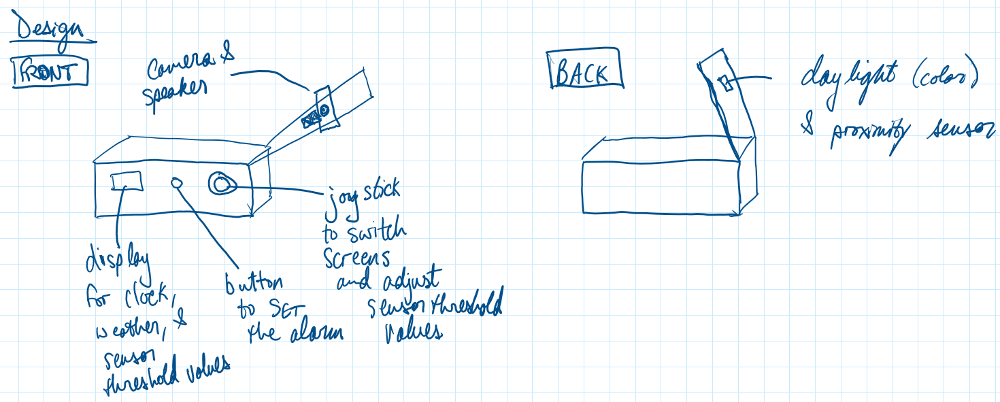

# Final Report

**The Smart Alarm Clock** by Jay Jain (uj26), Gazi Inkyad (gi45), and Brett O'Connor (bwo7)

All code can be found in the [scripts](scripts) folder.

## Problem and Goals

Oftentimes we struggle to set an alarm when we go to bed. Our schedules might be hectic or we might be caught up with other activities. Additionally, we may forget to check AM and PM signs for the alarms. Our clocksistant device automatically uses daylight to alert the user. The device could also be set with a certain light threshold to set the alarm. This way users can usually set an alarm that automatically alerts them without too much hassle.

Also, another problem we often face is not looking into weather for the day. Our device reminds the user of the temperature and chances of precipitation of the day. This way the user stays ahead and plans accordingly for the rest of the day.
Lastly, we often try to rush out of our home without properly thinking about outside temperature and how we should dress. This is a big problem for many users who have a busy schedule. To solve that problem our device looks at the user's outfit and comments on which temperature the outfit is most comfortable with.

## Project Plan

Our big idea is a smart personal clock with added functionality to serve as an assistant in some cases. This clock will have a daylight sensor to wake the user up during the day, but the user can also set the time they would like to wake up. It will have a screen that displays the time. The user will be able to ask the clock what the weather is. The user will also be able to add items to a to do list. We also want to use Teachable Machines to train our smart clock and have it tell users whether they are dressing appropriately based on the weather.

<u>Parts we need</u> 

* Light sensor
* Microphone
* Display monitor
* Speaker + webcam
* Cardboards
* Buttons
* Joystick
* Tape

<u>Risks and contingencies</u>

For teachable machines it might be difficult to make a good model that accurately identifies the person and the outfit the person is wearing to assess the proper quality of the outfit with the weather. Another contingency for this project will be to design the cardboard prototype for the device and make sure it fits all the hardware to support the functionalities of the device.

The following is a link to our Project Plan document:

[Project Plan](https://drive.google.com/file/d/1Ourc1TV-7gmQL2_kGTPseJO2pd2-pm6a/view?usp=sharing)

## Documentation of Design

Before we began buildilng, we thought about what we wanted our device to look like.  As seen in our sketch, on the front of the device we decided to have a joystick for the user to switch between different screens of the device and to change the daylight sensor's threshold.  We also included a button for the user to press to set the alarm.  Lastly, we placed the device's screen on the front side of the device so the user can easily see it.  On the front flap of the device, we added the camera and the speaker, enabling the user to easily point the camera at themselves and also to hear what the device had to say.  On the back of the flap, we placed the daylight sensor, so that the user can point the sensor towards the outdoor light source.

## Features

**Alarm Clock**

As shown in the image, the alarm clock feature enables the user to set an alarm before they go to bed.  The alarm clock will stay silent throughout the night and once there is daylight, the alarm will sound.  After the alarm rings, the clock will use text-to-speech to tell the user how long they slept for and what time it currently is.

**Asking the device about the weather**

The weather feature of this device, allows the user to ask the clock what the weather is for the current day or the next day in a specific location.  Once the weather is asked, the clock will tell the user the high temperatures, the low temperatures, and the chance of rain.

**Properly dressed for the weather**

The camera on our device is used to read what the user is wearing and determine what type of weather the user is dressed for.  This is to ensure the user is properly prepared for the outdoor conditions, when they are leaving their residence.

**Camera feature implementation**

For this feature of our device, we used a Teachable Machines model to allow users to figure out what weather they were dressed appropriately for. 

<u>Step 1</u>

The first step was to select an appropriate TeachableMachines model. We decided to go with an image project as that was the most appropriate for our application.

<u>Step 2</u>

Next, we had to train the model with instances/photos of our respective classes. For our model, we ended up choosing 4 main classes of outfits:

* below 45 degrees - puffer winter coat and pants
* 45-70 degrees - hoodie and pants
* 70-90 degrees - tshirt and shorts
* above 90 degrees - tank top and shorts

The image below shows our training process and classes:

<u>Step 3</u>

Once we had a trained TeachableMachines model, we downloaded the model as a Tensorflow Keras model that we could then import to the Raspberry Pi.

<u>Step 4</u> 

The final step was to import and call the Tensorflow model using a Python script. Furthermore, we also implemented a text to speech function in our script which would tell our user what weather they are dressed appropriately for.

## Build Process

To build this device, we used 5 rectangular pieces of cardboard, 1 additional rectangular piece of cardboard with a rectangular flap attached to it, and tape to hold it together.

 

We started by assembling our base, using the 5 pieces of rectangular cardboard and tape.  We then cut holes in our build for the device's screen, button, and joystick.

From here, we inserted our Raspberry Pi, with all of the necessary components attached, and taped the screen, button, and joystick to the holes that we previously cut.  We also cut a hole in our top cardboard piece for the camera, the daylight sensor, and the Raspberry Pi's power source.

After this, we installed the top cardboard piece and taped the camera and speaker to the front flap and the daylight sensor to the back flap.

## Interaction and how it works

The following video is one of our friends (Paul) interacting with our device.  It demonstrates each feature of the device:

[Paul using our device](https://drive.google.com/file/d/16YX67Cyal8E72CYIF8ZveoORG3xo1T73/view?usp=sharing)

## Reflection

We had fun working on this project but it gave us a good understanding of how to tackle different technical problems altogether. Most difficult part of the project was assembling different parts and functionalities together. We had to really put in some time to think about where to place which sensor, buttons, and inner components so we optimize the spacing of the device and functionalities. This process required us to be strategic and conscious of the component measurements. Additionally for our scripts and software we had to make sure everything was running properly as we had in the layout. That process required us to run multiple tests and debug using different settings. Lastly, synthesizing different functions into one script was a bit challenging since it required many other dependencies from different environments. Overall this was a solid project for us to learn speech to text, text to speech, multiple sensors and computer vision. Finally, combining the various things we have learned from the labs into an all in one project was very enriching and allowed us to apply ourselves in a great way. 

