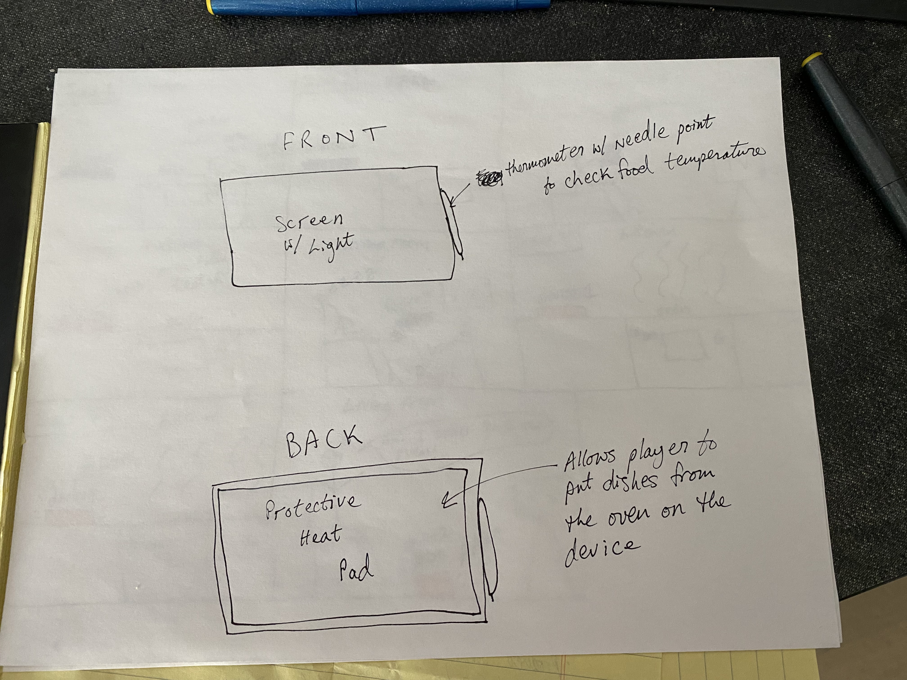

# Staging Interaction

In the original stage production of Peter Pan, Tinker Bell was represented by a darting light created by a small handheld mirror off-stage, reflecting a little circle of light from a powerful lamp. Tinkerbell communicates her presence through this light to the other characters. See more info [here](https://en.wikipedia.org/wiki/Tinker_Bell). 

There is no actor that plays Tinkerbell--her existence in the play comes from the interactions that the other characters have with her.

For lab this week, we draw on this and other inspirations from theatre to stage interactions with a device where the main mode of display/output for the interactive device you are designing is lighting. You will plot the interaction with a storyboard, and use your computer and a smartphone to experiment with what the interactions will look and feel like. 

_Make sure you read all the instructions and understand the whole of the laboratory activity before starting!_

## Prep

### To start the semester, you will need:
1. Set up your own Github "Lab Hub" repository to keep all you work in record by [following these instructions](https://github.com/FAR-Lab/Developing-and-Designing-Interactive-Devices/blob/2021Fall/readings/Submitting%20Labs.md).
2. Set up the README.md for your Hub repository (for instance, so that it has your name and points to your own Lab 1) and [learn how to](https://guides.github.com/features/mastering-markdown/) organize and post links to your submissions on your README.md so we can find them easily.
3. (extra: Learn about what exactly Git is from [here](https://git-scm.com/book/en/v2/Getting-Started-What-is-Git%3F).)

### For this lab, you will need:
1. Paper
2. Markers/ Pens
3. Scissors
4. Smart Phone -- The main required feature is that the phone needs to have a browser and display a webpage.
5. Computer -- We will use your computer to host a webpage which also features controls.
6. Found objects and materials -- You will have to costume your phone so that it looks like some other devices. These materials can include doll clothes, a paper lantern, a bottle, human clothes, a pillow case, etc. Be creative!

### Deliverables for this lab are: 
1. Storyboard
1. Sketches/photos of costumed device
1. Any reflections you have on the process
1. Video sketch of the prototyped interaction
1. Submit the items above in the lab1 folder of your class [Github page], either as links or uploaded files. Each group member should post their own copy of the work to their own Lab Hub, even if some of the work is the same from each person in the group.

### The Report
This README.md page in your own repository should be edited to include the work you have done (the deliverables mentioned above). Following the format below, you can delete everything but the headers and the sections between the **stars**. Write the answers to the questions under the starred sentences. Include any material that explains what you did in this lab hub folder, and link it in your README.md for the lab.

## Lab Overview
For this assignment, you are going to:

A) [Plan](#part-a-plan) 

B) [Act out the interaction](#part-b-act-out-the-interaction) 

C) [Prototype the device](#part-c-prototype-the-device)

D) [Wizard the device](#part-d-wizard-the-device) 

E) [Costume the device](#part-e-costume-the-device)

F) [Record the interaction](#part-f-record)

Labs are due on Mondays. Make sure this page is linked to on your main class hub page.

## Part A. Plan 

To stage the interaction with your interactive device, think about:

_Setting:_ Where is this interaction happening? (e.g., a jungle, the kitchen) When is it happening?

_Players:_ Who is involved in the interaction? Who else is there? If you reflect on the design of current day interactive devices like the Amazon Alexa, it’s clear they didn’t take into account people who had roommates, or the presence of children. Think through all the people who are in the setting.

_Activity:_ What is happening between the actors?

_Goals:_ What are the goals of each player? (e.g., jumping to a tree, opening the fridge). 

The interactive device can be anything *except* a computer, a tablet computer or a smart phone, but the main way it interacts needs to be using light.

\*\*
**Describe your setting, players, activity and goals here.**

**_Setting:_** A device is placed next to an oven in the kitchen.  This device's screen can also be displayed simultaneously on another device, nearby the device located next to the oven, meaning one could see what is displayed from the main device, if they were in a room outside of their kitchen. 

**_Players:_** The primary person involved is the person who turns on the oven and is waiting for it to heat up.  They usually will be holding a separate device or watching the device next to the oven.  In addition to this, their family could be involved and if they lived in an apartment, their neighbors might hear the "ding" or "alarm" sound given off by either devices. 

**_Activity:_** A person turns on the oven and the device turns blue.  The person is then able to use a handheld device to see the device's color in realtime.  As the oven heats up, the devices turn red.  Once the oven has reached the person's desired heat, the devices are completely red and sound off a "Ding".  If the person does not use the oven within 5 minutes, the devices turn orange.  Once the devices are orange, if 5 more minutes go by and the oven has not been used, the devices sound an "alarm".

**_Goals_:** The goal of the primary player is to quickly cook food for oneself and/or one's family using the oven.  These devices will fulfill this goal by telling the person as soon as the oven is heated.  Another goal is that the player does not want to cause a fire or hazard within his kitchen.  The devices will fulfill this goal by sounding an alarm when the oven has been heated for too long without interaction.
\*\*

Sketch a storyboard of the interactions you are planning. It does not need to be perfect, but must get across the behavior of the interactive device and the other characters in the scene. 

\*\***Include a picture of your storyboard here**

\*\*

Present your idea to the other people in your breakout room. You can just get feedback from one another or you can work together on the other parts of the lab.

\*\***Summarize feedback you got here.**

When I pitched this idea, many said it was a decent idea, however, most ovens these days tell you when the oven is properly heated.  Because of this, I decided to add the second device that would enable you to exit the kitchen, while the oven was on, and get the alert that it was heated outside of the kitchen.  Also, it is good to note that this idea caters more toward older ovens that do not tell you when the device is properly heated. 

\*\*

## Part B. Act out the Interaction

Try physically acting out the interaction you planned. For now, you can just pretend the device is doing the things you’ve scripted for it. 

\*\***Are there things that seemed better on paper than acted out?**

When I acted this device out, things went smooth and quite consistent to how I expected them to be.\*\*

\*\***Are there new ideas that occur to you or your collaborators that come up from the acting?**

I did notice that instead of having two devices, I might be able to just use one device that is mobile, which can wirelessly read a temperature sensor within the oven.  I feel that this would be more practical and realistic because you can use the device wherever you want, which includes the kitchen.\*\*

## Part C. Prototype the device

You will be using your smartphone as a stand-in for the device you are prototyping. You will use the browser of your smart phone to act as a “light” and use a remote control interface to remotely change the light on that device. 

Code for the "Tinkerbelle" tool, and instructions for setting up the server and your phone are [here](https://github.com/FAR-Lab/tinkerbelle).

We invented this tool for this lab! 

If you run into technical issues with this tool, you can also use a light switch, dimmer, etc. that you can can manually or remotely control.

\*\***Give us feedback on Tinkerbelle.**

Tinkerbell works well and is creative, espcially with the sounds.  It would be nice if the iPhone could be used in fullscreen mode. \*\*

## Part D. Wizard the device
Take a little time to set up the wizarding set-up that allows for someone to remotely control the device while someone acts with it. Hint: You can use Zoom to record videos, and you can pin someone’s video feed if that is the scene which you want to record. 

\*\***Include your first attempts at recording the set-up video here.**

[Setting up Tinkerbelle](https://youtu.be/hZ_whkIUkRI)

\*\*

Now, hange the goal within the same setting, and update the interaction with the paper prototype. 

\*\***Show the follow-up work here.**

Scene 1 - [Turning on the oven](https://youtu.be/0jKUdBpO7bE)

Scene 2 - [Device turning red in the kitchen](https://youtu.be/LS9ATyc3p1s) | [Device turning red in the living room](https://youtu.be/Mk7APGHyL7A)

Scene 3 - [Oven ready, device is red and plays a ding](https://youtu.be/CM_9ZRjprDQ) | [The player has fallen asleep!](https://youtu.be/R8uvVL6ftuI)

Scene 4 - [Oven has been running for a while](https://youtu.be/MOepwv-II4c)

Scene 5 - [Device alarm sounds and wakes the player up!](https://youtu.be/f377g2wtfiY)

\*\*

## Part E. Costume the device

Only now should you start worrying about what the device should look like. Develop a costume so that you can use your phone as this device.

Think about the setting of the device: is the environment a place where the device could overheat? Is water a danger? Does it need to have bright colors in an emergency setting?

\*\***Include sketches of what your device might look like here.**

\*\*

\*\***What concerns or opportunitities are influencing the way you've designed the device to look?**

This device contains the screen for the light, a thermometer with a needle point that is attached to the device by a magnet, and a protective heat pad on the back of the device.  The thermometer could be helpful when checking the food in the oven to see how rare the food is.  The heat pad on the back of the device could be useful when taking food out of the oven because you would be able to flip the device over and place the tray of food on the back of the device.  In terms of concerns, the device is prone to splattering food and water in the kitchen.  It also may be hard to hold if you were to carry it around with food on the back of it.  Some handles on the side may be useful, however, I was unable to find an intelligent way of putting these on the device.

\*\*

## Part F. Record

\*\***Take a video of your prototyped interaction.**

[Device Protoype](https://youtu.be/Jo15KdRkPyw)

\*\*

\*\***Please indicate anyone you collaborated with on this Lab.**

Aside from conversing with numerous students in the classroom, I worked alone on this lab.  I used YouTube to generate links for my videos and GitHub to upload my files to my repository.

\*\*
Be generous in acknowledging their contributions! And also recognizing any other influences (e.g. from YouTube, Github, Twitter) that informed your design. 

# Staging Interaction, Part 2 

This describes the second week's work for this lab activity.

## Prep (to be done before Lab on Wednesday)

You will be assigned three partners from another group. Go to their github pages, view their videos, and provide them with reactions, suggestions & feedback: explain to them what you saw happening in their video. Guess the scene and the goals of the character. Ask them about anything that wasn’t clear. 

\*\***Summarize feedback from your partners here.**

Most of my feedback was positive.  Each person understood my idea and thought it would be very applicable, espcially to older ovens.  The common critique I received was that instead of having two devices - one mobile and one stationary device - I could just have the device be mobile.  Another critique that I got was that the heatpad on the back of the device was not needed, however, in my opinion, this was part of dress-up the device and making it service two purposes.

\*\*

## Make it your own

Do last week’s assignment again, but this time: 
1) It doesn’t have to (just) use light, 
2) You can use any modality (e.g., vibration, sound) to prototype the behaviors! Again, be creative!
3) We will be grading with an emphasis on creativity. 

\*\***Document everything here. (Particularly, we would like to see the storyboard and video, although photos of the prototype are also great.)**

**_Setting:_** A a mobile device is wirelessly connected to an oven in the kitchen.  Because it is wireless, the device can be taken to any room within a household or apartment, in addition to the kitchen.   

**_Players:_** The primary person involved is the person who turns on the oven and is waiting for it to heat up.  They usually will be holding the device connected to the oven.  In addition to this, their family could be involved and if they lived in an apartment, their neighbors might hear the "ding", "sizzle", or "alarm" sound given off by either devices. 

**_Activity:_** A person turns on the oven and the device turns blue.  The person is then able to use it as a handheld device and see the device's color in realtime.  As the oven heats up, the device turns red.  Once the oven has reached the person's desired heat, the device is completely red and sounds off a "Ding".  If the person does not use the oven within 5 minutes, the device turns orange and repeats a "sizzle" sound.  Once the device is orange, if 5 more minutes go by and the oven has not been used, the device sounds an "alarm".

**_Goals_:** The goal of the primary player is to quickly cook food for oneself and/or one's family using the oven.  The device will fulfill this goal by telling the person as soon as the oven is heated.  Another goal is that the player does not want to cause a fire or hazard within his kitchen.  The device will fulfill this goal by sizzling and sounding an alarm when the oven has been heated for too long without interaction.

**_Storyboard:_**

**_Prototype:_**

[Device Design 1](device-sketch.jpg)

[Device Protoype](https://youtu.be/Jo15KdRkPyw)

**_Scenes:_**

Scene 1 - [Turning on the oven](https://youtu.be/0jKUdBpO7bE)

Scene 2 - [Device turning red in the kitchen](https://youtu.be/LS9ATyc3p1s) | [Device turning red in the living room](https://youtu.be/Mk7APGHyL7A)

Scene 3 - [Oven ready, device is red and plays a ding](https://youtu.be/CM_9ZRjprDQ) | [The player has fallen asleep!](https://youtu.be/R8uvVL6ftuI)

Scene 4 - [Oven has been running for a while](https://youtu.be/MOepwv-II4c)

Scene 5 - [Device alarm sounds and wakes the player up!](https://youtu.be/f377g2wtfiY)

\*\*
